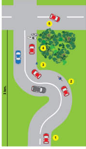

# ¿Están capacitadas las personas para responder a las exigencias del tránsito?

### Posición 1

* Está oscureciendo, está nublado y la visibilidad es reducida.
* La carretera parece desaparecer al final de una cuesta.
* La velocidad es de 90 kilómetros por hora y el conductor ve cómo la carretera continúa más allá.
* Él espera que haya una curva hacia la izquierda.
* Decide cambiar de sintonía la radio.


De pronto se lleva una sorpresa: la carretera tiene una curva hacia la derecha, viéndose obligado a maniobrar bruscamente, al mismo tiempo que afloja la presión sobre el acelerador. Por suerte, el pavimento está seco y tiene buena fricción.


### Posición 2

* Después de la curva a la derecha hay una hacia la izquierda, y poco después de ésta.
* Se acerca algo que parece ser una motocicleta, pero resulta ser un automóvil cuyo foco izquierdo va apagado.
* Está a punto de pasar un ciclista y la carretera es demasiado estrecha para dar cabida a 3 vehículos.


Nuestro automovilista se ve obligado a reducir la velocidad porque el riesgo es muy alto.


### Posición 3

* Luego de unos cientos de metros, nuestro conductor se cruza con un vehículo cuyas luces bajas son muy potentes \(quizás estén mal ajustadas\).


Sorpresivamente, descubre a un peatón que transita a escasos metros delante de su vehículo. Este peatón no lleva nada reflectante, pero camina por el borde de la calzada, por lo que puede evitarse un accidente.


### Posición 4

* El conductor comienza a sentir una sensación de disgusto. Piensa en lo ocurrido en el último kilómetro.
* Ingresa a una zona con bosques a ambos lados de la carretera a 90 kilómetros por hora.


Con su atención dispersa, descubre dos animales que están cruzando de izquierda a derecha, a unos 100 metros delante de su automóvil.


### Posición 5

* El conductor frena algo y continúa a una velocidad más baja, ya que luego virará a la derecha.
* Rápidamente llega al cruce.
* Al virar a la derecha, sobrepasa la línea central, que marca el eje de la calzada.


Sin embargo, no ocurre un accidente porque no venían vehículos en sentido contrario.


A lo largo de estos kilómetros se han manifestado aspectos importantes del tránsito y del comportamiento del conductor. A continuación se examinarán las situaciones que surgieron, conjeturando acerca de lo que pudo suceder.

