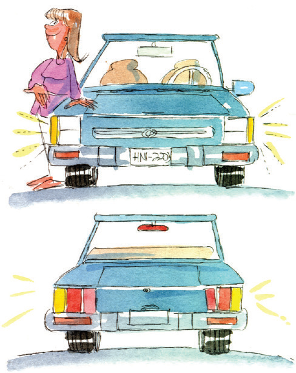

# Las luces

Todos los vehículos deben estar provistos de focos y luces exteriores para poder ver y ser visto por los demás usuarios cuando se conduce en la oscuridad o cuando la visibilidad se encuentra reducida, así como para poder advertir al resto determinadas situaciones o la intención de realizar algunas maniobras.

Así, los automóviles y, en general, los vehículos motorizados de 4 o más ruedas, deben poseer los siguientes focos y luces exteriores:

* **Parte delantera**: Dos focos que proyecten luces altas y bajas, dos luces de estacionamiento y dos luces destellantes de viraje.
* **Parte trasera**: Dos luces de estacionamiento, dos luces destellantes de viraje, dos luces de retroceso, dos luces rojas fijas, dos luces de freno y una luz que ilumine la placa patente del vehículo.

Adicionalmente, debe contar con una tercera luz de freno ubicada al centro de la luneta trasera de los automóviles, furgones, SUV, camionetas y vehículos de transporte de escolares.

**Asegúrese** de que sus luces estén limpias, que funcionen y que sus focos de luces altas y bajas estén bien ajustados. Un mal ajuste puede encandilar a los demás usuarios de la vía y causar un accidente.


Usted puede controlar que sus luces bajas no cieguen, para ello:

* Estacione su vehículo en un lugar plano y a unos 10 metros de una pared o algo similar.
* Encienda sus luces bajas y luego verifique que el alto de la luz proyectada en la pared sea inferior a la altura de los faros respecto del nivel del suelo.


## Luces neblineras

Algunos vehículos, además de contar con las luces antes señaladas que son obligatorias, están provistos también de luces neblineras. Éstas pueden usarse sólo cuando la visibilidad se encuentre considerablemente reducida, ya sea a consecuencia de la niebla o de una lluvia torrencial, y deben apagarse tan pronto mejore la visibilidad.

## Luces de advertencia de peligro

Las luces intermitentes de advertencia de peligro sólo deben utilizarse cuando el vehículo se encuentre detenido a consecuencia de una falla o avería, para avisar que temporalmente se está obstruyendo la circulación, así como también para advertir a los conductores, que vienen detrás suyo, de un peligro u obstrucción que haya más adelante. Deben usarse sólo por el tiempo que sea necesario para que los demás noten su advertencia, nunca como una excusa para un estacionamiento peligroso o ilegal.

