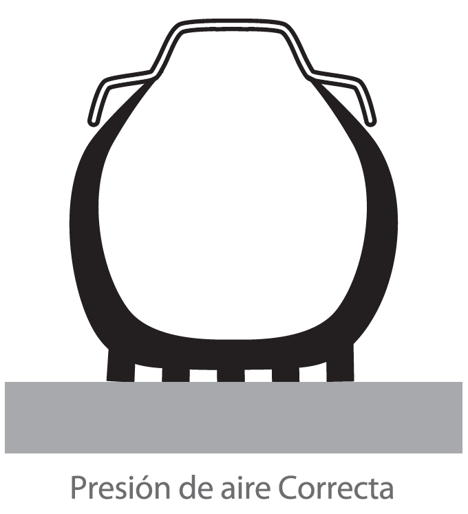
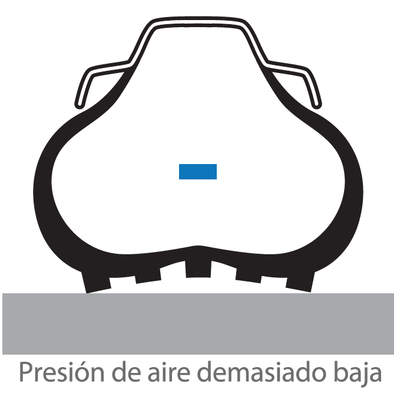
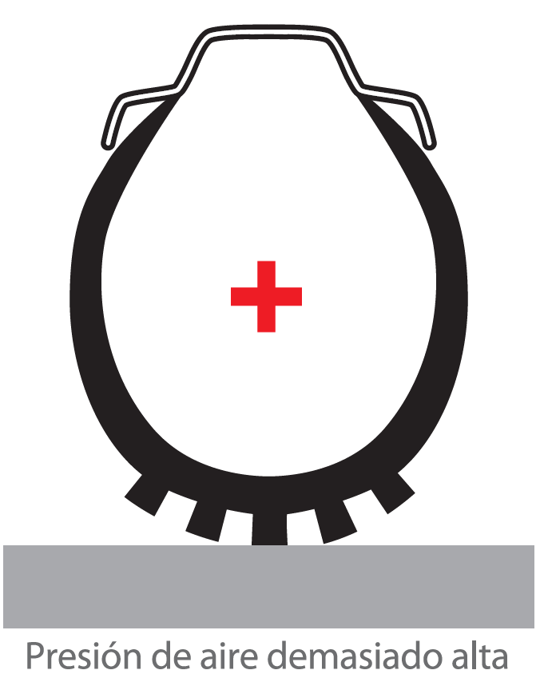

# Los neumáticos

Los neumáticos son el único punto de apoyo del vehículo con la calzada. El agarre de los mismos aporta la seguridad necesaria bajo cualquier condición meteorológica, incluso en situaciones difíciles.

Para que los neumáticos cumplan bien sus funciones de frenado, agarre y direccionalidad, los dibujos o surcos de sus bandas de rodamiento deben tener una profundidad aconsejable mínima de 3 mm. Cuando la profundidad de tales dibujos es muy baja \(inferior a 1,6 mm\) empeora la fricción con el pavimento mojado, aumentando el riesgo de que se pierda el contacto con el pavimento a causa de la capa de agua que se forma delante de los neumáticos. Acostúmbrese a revisar periódicamente sus neumáticos y a constatar que sus detectores de desgaste de la profundidad de los surcos no le indiquen que ésta es inferior a 1,6 mm.


De los distintos elementos de un vehículo, los neumáticos son los que requieren mayor revisión de parte del conductor.


Revise también regularmente la presión del aire en ellos. Un desgaste irregular puede deberse a problemas de alineamiento o de amortiguación, o a que ha estado conduciendo con una presión de aire inadecuada. Debe mantener los neumáticos a la presión indicada por el fabricante para evitar que el automóvil patine.

Un desgaste notorio en la zona central de la banda de rodamiento significa que los neumáticos se han usado con exceso de aire, mientras que un desgaste sólo en los extremos de la banda indica que se han usado con menor presión de aire que la recomendada.

Una presión de aire demasiado baja en una o en las dos ruedas traseras puede aumentar significativamente la tendencia al giro. Con una baja presión de aire en las ruedas delanteras la dirección del vehículo es más pesada, y por ende el vehículo es más pesado de manejar. Una baja presión de aire en una rueda delantera hace que el vehículo tienda a torcer hacia ese lado.

Cuando la presión de los neumáticos es superior a la indicada por el fabricante se pierde la adherencia de los neumáticos.

Siempre los mejores neumáticos deben ir atrás, indistintamente de la ubicación de las ruedas de tracción, para asegurar la mejor estabilidad.


Reducir la presión de los neumáticos por debajo de la indicada por el fabricante a causa de la llegada del invierno, disminuye la vida útil de éstos.


#### Otras recomendaciones

* Controle la presión de los neumáticos cuando éstos estén fríos y respete las recomendaciones del fabricante. Si la presión se ajusta cuando los neumáticos están calientes, se tendrá una presión inferior a la adecuada. Una presión inadecuada contribuye al riesgo de patinaje.
* Inspeccione también periódicamente la banda de rodadura. Ésta no debe tener cortes profundos ni grietas.
* Circule a una velocidad moderada, eso alarga la vida de los neumáticos.
* Tenga en cuenta que situaciones como circular con carga, o por un pavimento en mal estado o un clima caluroso, pueden acelerar el desgaste de los neumáticos.
* Si detecta algo anormal en los neumáticos o en el comportamiento del vehículo \(como vibraciones al circular, por ejemplo\), es bueno buscar asesoría de un profesional. Podría haber un problema de balanceo.
* Los neumáticos deben ser cambiados al menos cada 5 años. Aunque tengan poco uso y su dibujo esté bien, el material envejece y pierden sus propiedades para rodar con seguridad. Es recomendable que acuda a un profesional para que lo asesore en el cambio de neumáticos.
* Si sube escalones o veredas con su vehículo, pueden producirse deformaciones en las llantas y cortes o roturas en los neumáticos.
* Aumente levemente la presión de los neumáticos cuando lleve una carga muy pesada.
* Cuando deje la rueda de repuesto en su vehículo, asegúrese que ésta se encuentre con la presión más alta recomendada por el fabricante.
* Cuide que los neumáticos se encuentren correctamente balanceados.


Si al ir conduciendo se revienta un neumático trasero de su vehículo, usted debe girar el volante hacia el lado en que se desvía la cola del vehículo.

Si de lo contrario se revienta un neumático delantero, usted debe frenar de forma suave sosteniendo el volante firmemente.


